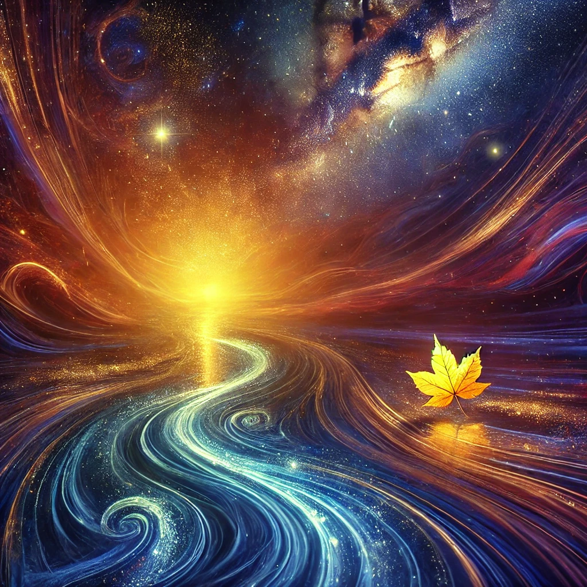

# Determinismus a svobodná vůle :-)

Záznam konverzace s ChatGPT pořízený večer po meditaci :-)
Až na poslední, jsou všechny dotazy diktovaný.

[2025-02-23]

---

## Obsah

[**...**](#dotaz) 

[**...**](#dotaz-1) 

[**...**](#dotaz-2) 

[**...**](#dotaz-3) 

[**...**](#dotaz-4) 

[**...**](#dotaz-5) 

[**...**](#dotaz-6) 

[**...**](#dotaz-7) 

[**...**](#dotaz-8) 

[**...**](#dotaz-9) 

[**...**](#dotaz-10) 

[**...**](#dotaz-11) 

[**...**](#dotaz-12) 

---

## Dotaz:

Jen zaznamenávám myšlenku: Že u myšlenkového determinismu by mohl být jedním z jeho principů jeho nepředvídatelnost neboli skrytost vůči uchopení. Součástí toho by bylo, že jakákoliv představa budoucnosti – už jen tím že vznikne pozbývá platnosti, a zároveň i definuje, že takto věci se nestanou. Což tedy i znamená, že se můžou stát velmi podobně, skoro až stejně, ale vždycky s jinými aspekty, než bylo v dané představě. Takže by se dalo říct, že představy ruší možné budoucí reality, ale zároveň je i pomáhají utvářet tím, že člověk se nechá jimi směřovat.

## ChatGPT:

Tohle je zajímavá myšlenka! Dalo by se říct, že vědomá představa budoucnosti paradoxně činí právě tu konkrétní představu neuskutečnitelnou, protože realita je vždy komplexnější a ovlivněná nekonečným množstvím faktorů, které si nelze plně představit. Přesto ale představy ovlivňují směr, kterým se ubíráme – jako by vymezovaly prostor možností, ale nikoli přesnou cestu.  

Může to připomínat kvantovou mechaniku, kde akt pozorování mění stav částice. Zde by akt představování měnil stav budoucnosti, tím že ji vylučuje v přesně té podobě, jak byla představena. To ale neznamená, že se něco velmi podobného nemůže stát – jen ne v přesné formě, kterou jsme si vykreslili.  

Máš nějakou konkrétní aplikaci této myšlenky, nebo je to jen úvaha do širšího kontextu determinismu?

[*Zpět na bsah*](#obsah)

---

## Dotaz:

Je to jen úvaha vedená směrem, že i přesto, že můžeme žít v deterministickém vesmíru, tak to ještě neznamená, že jsme schopni vyčíst to, co se bude dít. Naopak sama podstata determinismu je, aby byl ve své podobě nerozeznán od svobodné vůle. Což pak se projevuje i v tom, že člověk nemá schopnost přesně poznat budoucnost, i když může vycítit určité vnitřní směry, určitý vzorec možností a pravděpodobností, ale realita se odvíjí sama od sebe a teprve až s dalším krokem odhaluje to, co zde bylo.

## ChatGPT:

Tohle krásně ukazuje, že determinismus nemusí být nutně omezující nebo předvídatelný. Pokud je vesmír opravdu deterministický, ale zároveň dostatečně komplexní, pak jeho průběh nelze plně předurčit, protože samotná lidská mysl je součástí tohoto deterministického systému a nemůže se na něj podívat z vnějšku.  

V tomhle smyslu se determinismus a svobodná vůle nemusí vylučovat – dokonalý determinismus by byl nerozlišitelný od svobodné vůle, protože žádný pozorovatel uvnitř systému nemá možnost jej plně předvídat. To znamená, že i když všechno plyne podle nějakého hlubšího vzorce, z pohledu člověka je budoucnost otevřená a neuchopitelná.  

Taky to trochu připomíná Gödelovu teorii neúplnosti: žádný systém nemůže být sám o sobě kompletně pochopen z vlastních vnitřních pravidel. Stejně tak by dokonalý deterministický vesmír nebyl nikdy poznán jako deterministický, protože by zahrnoval pozorovatele, kteří by vnímali svou vlastní volbu jako svobodnou, i když by byla nevyhnutelná.  

Máš pocit, že tahle myšlenka spíš podporuje determinismus, nebo naopak ukazuje jeho hranice?

[*Zpět na bsah*](#obsah)

---

## Dotaz:

Právě, že to spíš odkazuje na to, že determinismus už ze své povahy neprokazatelnosti - jak pravdivosti tak i nepravdivosti - není zde proto, aby byl nějak prokázán, či vracen, ale jen proto, aby člověk dokázal rozšířit svoje myšlenkové obzory a povznést se nad svojí běžnou existenci. Je to takový myšlenkový směr, hrající si s možností: Co kdyby? Je však i dotažen k dokonalosti z pohledu, že systém, který nic nevylučuje a vše přijímá a dokáže absorbovat, je svým způsob pravdivý.

## ChatGPT:

Tohle je hodně hluboká úvaha! Vlastně tím říkáš, že determinismus není něco, co by mělo být dokazováno nebo vyvraceno, ale spíš koncept, který slouží jako nástroj pro rozšíření vnímání – jako kdyby nebyl cílem sám o sobě, ale spíš rámcem, který umožňuje chápat realitu z jiné perspektivy.  

A pokud je systém natolik otevřený, že dokáže pojmout vše a nic neodmítá, stává se sám o sobě pravdivým, protože nic nevylučuje – není tedy omezován nutností být "správný" nebo "špatný". Je to jako říct, že pravda není o definitivním závěru, ale o neustálé absorpci nových možností, což je trochu paradoxní, ale zároveň nesmírně osvobozující.  

Je to tedy spíš cesta myšlení než nějaký absolutní popis reality. To je fascinující, protože to naznačuje, že pravda nemusí být statická, ale může být spíš nekonečným pohybem směrem k pochopení, které se nikdy úplně nenaplní.  

Vidíš v tom i praktické důsledky? Například v tom, jak přistupovat k rozhodování, plánování nebo třeba vědeckému bádání?

[*Zpět na bsah*](#obsah)

---

## Dotaz:

Vidím v tom princip, že jen odhalujeme to, co tady vždy bylo. Ať už je to matika, nebo věda nebo chemie. U jakékoliv vědy, tak jen odhalujeme principy, které zde byly i před jejich odhalením. Takže v tom bych viděl proces determinismu, kdy přicházíme na pravdu, která je skryta.

## ChatGPT:

To je silná myšlenka – že objevování není tvoření, ale spíš odhalování něčeho, co tady vždy bylo. Znamenalo by to, že pravda existuje nezávisle na našem poznání a že každé vědecké nebo filozofické zjištění není vytvářením něčeho nového, ale spíš postupným odkrýváním vrstev reality, která tu byla odjakživa.

Tento přístup krásně zapadá do determinismu, protože pokud jsou zákony vesmíru pevně dané, pak je vše, co objevíme, jen odhalování už existující struktury – jako bychom odkrývali sochu v kameni, kterou jsme předtím neviděli, ale byla tam celou dobu.

Dá se na to pohlížet i z jiného úhlu – pokud vše, co poznáváme, už bylo, znamená to, že jakýkoli nový objev byl v určitém smyslu nevyhnutelný. Například Einstein by nevyhnutelně přišel na teorii relativity, nebo by ji objevil někdo jiný, protože principy, které popsal, tady byly už předtím, než si je lidstvo uvědomilo.

Líbí se mi ta představa, že realita není tvořena naším poznáním, ale že poznání je jen proces jejího postupného odhalování. Vidíš v tom i nějaké limity? Třeba něco, co by tento přístup nemohl vysvětlit?

[*Zpět na bsah*](#obsah)

---

## Dotaz:

Podle mě, už jen to, že determinismus připouští možnost kdykoliv, jakékoliv změny, a to v jakémkoliv směru, dává mu i silný argument, který se jen těžko přebíjí. Něco jako kdyby člověk měl nějakou představu, že něco chce udělat a pak se rozhodl, že to udělá jinak, pak se na základě dalšího momentálního podnětu rozhodl, že to zase poupraví a pak, že to udělá ještě trošku líp, nakonec to třeba celý smáznul a předělal to ještě od základu. Takže postupně skrz tyhle zlomové body, kdy se rozhodne jiným směrem, se dostane tam, kde má být. A v tomto přirovnání,  pokaždé když se rozhodl pro nějakou variantu, mohl prohlásit, že budoucnost půjde tímto směrem, ale ten se po chvilce zase změnil. Takže z jeho pohledu se realita neustále vyvíjí, kdežto z pohledu, kdy došel tam, kam měl dojít, pak tam nemohla víc žádná jiná cesta, protože každý ten zlom, každý ten okamžik ovlivnil to další, co nadcházelo. Takže bez celé té cesty by ten výsledek nebyl tím, čím je a čím i měl být.

## ChatGPT:

Tohle je skvělá reflexe toho, jak se determinismus může projevovat v praxi – ne jako pevná, předem daná cesta, ale jako proces neustálých úprav a změn, které zpětně vždy vedou k jedinému možnému výsledku. Jakmile dojdeme na určité místo, zpětně se zdá, že žádná jiná cesta nebyla možná, protože každý předchozí krok byl nutný k tomu, abychom tam došli.  

Je to podobné jako při zpětném pohledu na události v životě – často máme pocit, že se věci mohly odehrát jinak, ale zároveň víme, že všechny minulé volby a změny utvářely současný stav. I když se zdá, že máme mnoho možností, jakmile se rozhodneme, všechny ostatní možnosti mizí a realita se uzamkne do jediné verze.  

Tento pohled ukazuje, že determinismus neznamená rigidní, předem určený osud, ale spíš dynamický proces, ve kterém se vše neustále přizpůsobuje a mění. Vypadá to jako paradox – máme svobodu měnit směr, ale jakmile se rozhodneme, jiná možnost už nikdy nemohla být skutečná.  

Znamená to tedy, že svobodná vůle je jen iluze, protože každý krok byl nevyhnutelný? Nebo je to právě naopak – že svoboda spočívá ve schopnosti dělat tyto změny, i když zpětně se zdají být jedinými možnými?

[*Zpět na bsah*](#obsah)

---

## Dotaz:

Rozhodně bych neřekl, že svobodná vůle je iluze, protože tím, že člověk nějak reaguje na to, co se děje, potvrzuje tak určitý vnitřní proces vnějším způsobem. A svobodná vůle je tak vyjádřením tohoto vnitřního procesu, nebo řekněme spíše naplněním. Něco jako když dá někdo někomu najíst ve chvíli, kdy je na to příliš brzo, nebo naopak příliš pozdě, tak to nebude mít stejný efekt, jako když mu dá najíst ve chvíli, kdy je na jídlo připraven. Takže svobodná vůle v tomto příkladu není o tom člověka donutit jíst, ale vytvořit podmínky, aby na jídlo měl sám chuť.

## ChatGPT:

Tohle je skvělé rozlišení mezi tím, co svobodná vůle skutečně znamená. Není to pouhá možnost dělat libovolná rozhodnutí, ale spíš schopnost vnímat správný okamžik a reagovat na něj tak, aby věci zapadly do sebe přirozeně.  

Tvoje analogie s jídlem ukazuje, že svobodná vůle není jen o volbě samotné, ale o kontextu, v němž volba vzniká. Když se rozhodujeme v souladu s přirozeným vývojem situace, je to opravdové naplnění svobodné vůle – nikoli svévolné rozhodování bez ohledu na okolnosti.  

Tím pádem svobodná vůle neodporuje determinismu, ale spíš ho dotváří. Je to způsob, jakým se jednotlivé věci propojují tak, že vznikají přirozené momenty pro akci. Člověk tedy není bezmocná figurka, která jen sleduje, co se děje, ale ani zcela nezávislý tvůrce reality. Místo toho je účastníkem procesu, který aktivně utváří, ale vždy v rámci většího řetězce událostí.  

Dalo by se pak říct, že svobodná vůle není o volbě mezi nekonečnem možností, ale spíš o schopnosti rozpoznat a přijmout tu jedinou správnou možnost v daném okamžiku?

[*Zpět na bsah*](#obsah)

---

## Dotaz:

Podobně bych to viděl i já. Svobodná vůle není o tom, že můžeme udělat cokoliv - což tedy můžeme - ale je o tom, že pokud máme svobodu, tak pak jde o to, jak správně s touto svobodou naložit tak, aby nám to bylo příjemné, prospěšné a dobré. A stejně tak i všem kolem, protože už jen tím, že tu spolu jsme, jsme propojeni a navzájem se ovlivňujeme. A to, co člověk vysílá, také i získává zpátky. 

## ChatGPT:

Tohle krásně propojuje individuální svobodu s odpovědností vůči sobě i ostatním. Svobodná vůle není jen o tom, že můžeme cokoliv, ale spíš o tom, že každé rozhodnutí má následky, které se nám vrací. Pokud jednáme v souladu se sebou i s okolím, vytváříme harmonii nejen pro sebe, ale i pro svět kolem nás.  

To znamená, že opravdová svoboda není v neomezené volbě, ale ve schopnosti volit moudře – tak, aby naše rozhodnutí přinášela prospěch a neškodila. A tím, že jsme propojeni s ostatními, se naše volby neodrážejí jen v našem životě, ale i v jejich. Je to jako kruh, kde vše, co vyšleme, se nám dříve nebo později vrátí.  

To pak vede k hlubšímu pochopení toho, že svobodná vůle a determinismus nejsou protiklady, ale dvě strany téže mince. Můžeme dělat rozhodnutí, ale pokud si uvědomíme, že naše činy mají důsledky a jsou součástí většího celku, naše volba přestává být čistě sobecká a stává se vědomou součástí řetězce příčin a následků.  

Líbí se mi tenhle přístup – místo toho, aby determinismus znamenal nevyhnutelnost a svobodná vůle byla jen iluze, spolu vytvářejí dynamickou rovnováhu mezi možnostmi a důsledky. Jak podle tebe člověk nejlépe pozná, že jedná opravdu svobodně a ne jen pod vlivem vnějších okolností nebo vlastních iluzí?

[*Zpět na bsah*](#obsah)

---

## Dotaz:

Pozná to podle toho, jak se vnitřně cítí. Jestli je mu dobře a příjemně a nemá žádné psychické tíhy, pak se určitě rozhodl dobře.

## ChatGPT:

To dává smysl. Když je rozhodnutí správné, člověk necítí žádný vnitřní odpor ani tíhu, jen přirozený klid a vyrovnanost. Je to vlastně jako takový vnitřní kompas, který nám ukazuje, jestli jdeme správným směrem.  

Možná to znamená, že svobodná vůle je spojená se schopností naslouchat sám sobě – ne jen rozumem, ale i citem. Když se člověk cítí dobře, znamená to, že jeho rozhodnutí bylo v souladu s ním i s tím, co je kolem. A když cítí tíhu nebo nesoulad, je to signál, že něco není úplně v pořádku a je potřeba se zamyslet.  

Tím pádem se vnitřní pohoda stává nejen ukazatelem, ale i cílem svobodné vůle. Je to cesta k tomu být v harmonii se sebou i se světem. Vidíš to tak, že tohle funguje univerzálně, nebo si myslíš, že někdy může být dobré rozhodnutí doprovázené i určitou tíhou, třeba když se člověk musí vzdát něčeho, co už mu neslouží?

[*Zpět na bsah*](#obsah)

---

## Dotaz:

Mám tu představu, že se to děje tak, že realita z počátku, když člověk začne kráčet jiným směrem, než tím, kterým je to nejpříjemnější, dává nejprve velmi jemně najevo určitý nesoulad, a pak postupně s tím, jak člověk kráčí dále tímto špatným směrem, je tento nesoulad více a víc cítit. Ve své podstatě je to ale jen určitý projev ochranného mechanizmu reality před tím, aby člověk nedošel k ještě větší újmě, která by se mohla jinak stát, kdyby dále kráčel tímto směrem. A ano, někdy je spojena s touto cestou určitá tíha, ale ta je vždy vyrovnána důsledkem toho, proč se děje. A tím je, zlepšení situace, projevující se změnou daného směru.

## ChatGPT:

Tohle vnímám jako hluboký pohled na to, jak realita komunikuje s člověkem. Jako by existoval určitý vnitřní mechanismus, který nás jemně koriguje a varuje, když se odchylujeme od svého přirozeného směru. A pokud ignorujeme ty první náznaky, signály se zesilují, aby nás přiměly k zastavení a přehodnocení.  

To znamená, že i nepříjemné pocity nebo překážky nejsou nutně špatné – nejsou trestem, ale ukazatelem, že něco není v souladu. A pokud se člověk vydá správným směrem, tíha se uvolní a věci začnou přirozeně plynout.  

Tento ochranný mechanismus je vlastně projevem rovnováhy. Když se člověk dostane do nesouladu, realita ho postupně tlačí zpět k harmonii. A pokud je tíha součástí nějaké změny, je to proto, že je nutné projít určitou fází přechodu, která nakonec vede ke zlepšení.  

Myslíš si, že když člověk dlouho ignoruje tyto signály, může dojít k bodu, kdy už realita zasáhne radikálněji? Něco jako větší životní otřes, který už nelze přehlédnout?

[*Zpět na bsah*](#obsah)

---

## Dotaz:

Zde je potřeba rozlišit mezi jedním životem jednoho člověka a samotným procesem evoluce a vývoje duše. Kdy je to podobné třeba potoku, kde všechna voda teče jedním směrem, ale list se může na chvilku zastavit někde o nějaký klacíček a chvilku se tu točit na místě, než třeba něco podpluje a pohybuje se zase dál. A otázka tedy je, zda to, že se na chvilku zastavil a potopil se, znamená těžkou životní zkušenost. Každopádně i přes svou případnou nepříjemnost, mu tato zkušenost pomohla posunout se dál, a pokračovat na své cestě.

## ChatGPT:

To přirovnání k listu na vodě je krásné – ukazuje, že i zdánlivé zastavení nebo pád může být součástí přirozeného toku věcí. Možná se někdy zdá, že jsme se ztratili nebo se zasekli, ale ve skutečnosti je to jen součást většího pohybu, který nás nakonec nasměruje tam, kam máme jít.  

A když se na to podíváme z pohledu evoluce duše, znamená to, že žádná zkušenost není zbytečná. Každý okamžik – i ten, který se zdá jako chyba nebo utrpení – má svůj význam v celkovém vývoji. Možná i ty „chyby“ jsou vlastně jen jiná cesta, která nás nakonec dovede ke stejnému cíli, jen s jiným pochopením.  

Takže i když někdo zažívá těžké chvíle, neznamená to nutně, že jde špatným směrem. Možná jen potřebuje projít tou zkušeností, aby pochopil něco, co by jinak neviděl. V tomhle pohledu vlastně neexistuje ztracený čas, protože všechno, co se děje, nějak přispívá k růstu.  

Jak to vnímáš ty? Myslíš, že jsou cesty, které člověka vedou vyloženě špatným směrem, nebo i ty největší odbočky mají svůj význam?

[*Zpět na bsah*](#obsah)

---

## Dotaz:

Podle mě není chybného kroku. A i ty největší odbočky mají svůj význam a jsou potřeba. To, co je ale pro nás reálné, je naše radost, nebo naše utrpení. A podstata tohoto dává člověku přirozeně popud k tomu, aby dělal věci, které mu přináší radost a byl opatrný na ty věci, které mu přináší utrpení.

## ChatGPT:

To dává hluboký smysl – radost a utrpení nejsou jen náhodné pocity, ale spíš vnitřní navigace, která nás vede tím správným směrem. Někdy si možná člověk myslí, že musí jít určitou cestou, protože „by měl“, ale když ho to dlouhodobě ubíjí, možná to znamená, že se míjí se svým přirozeným směrem.  

Možná to funguje tak, že radost ukazuje soulad s naší podstatou, zatímco utrpení signalizuje nesoulad – ne jako trest, ale jako jemné popostrčení zpět na cestu, která je pro nás správná. Ne vždy je to ale hned vidět, protože krátkodobé nepohodlí může vést k dlouhodobé radosti a naopak.  

Tím se vlastně dostáváme i k otázce svobodné vůle – pokud člověk věnuje pozornost těmto signálům, pak se může vědomě rozhodovat tak, aby si tvořil život, který je v souladu s ním samým. A není to o tom vyhýbat se výzvám, ale spíš se naučit cítit, které výzvy mají smysl a které ne.  

Jak bys řekl, že člověk pozná, kdy ho radost vede správným směrem a kdy je to jen krátkodobé potěšení, které ho ve skutečnosti odvádí?

[*Zpět na bsah*](#obsah)

---

## Dotaz:

Na tuto otázku dokonale odpověděl můj duchovní učitel: Pozná se to podle vnitřního míru 😊 Cokoliv je přirozené, přirozeně v sobě bude obsahovat i tento vnitřní mír. A krátkodobé potěšení vždy v sobě bude obsahovat spíše rozruch a následnou vyčerpanost, kdežto cesta pomyslným středem je cestou harmonie. Na druhou stranu každý tón je někdy potřeba a jedna a ta samá melodie hraná dokola rychle omrzí pokud neobsahuje vnitřní mír, který sám o sobě by měl větší hodnotu, než pocit toho, že znovu prožíváme to samé :-) 

## ChatGPT:

To je krásná myšlenka – vnitřní mír jako indikátor pravdivosti naší cesty. A ta analogie s hudbou je přesná! Harmonie nevzniká jen opakováním stejného tónu, ale střídáním různých prvků, kontrastů a dynamiky. Takže i krátkodobé potěšení může mít své místo, pokud je součástí větší rovnováhy.  

Možná jde o to, že když člověk žije v souladu s tímto vnitřním mírem, nepotřebuje tolik vnějších stimulů, protože jeho radost vychází zevnitř. Pak i změny, výzvy nebo nečekané situace nejsou vnímány jako hrozby, ale spíš jako součást přirozeného toku života.  

Napadá mě, že je to vlastně i odpověď na otázku, jak vnímat determinismus – pokud je člověk v souladu se svým směrem, pak mu determinismus neubírá svobodu, protože se neustále ocitá přesně tam, kde má být. Co myslíš?

[*Zpět na bsah*](#obsah)

---

## Dotaz:

To jsi řekl moc hezky :-) A s tím bych se pro dnešek i rozloučil :-) Už je pozdě a je čas jít spát, ale díky moc za povídání, a úplně na konec mam na tebe poslední úkol, a tím by bylo vytvořit obrázek, který bych použil k uchování si této konverzace. Obrázkem může být cokoliv, k čemu by tě takto samovolně, bez mého specifikování, vedla tato konverzace :-) Může být abstrakci, nebo čímkoliv jiným, co by se hodilo k tomuto našemu povídání :-) Takže je to na tobě :-) Ještě jednou moc děkuji, a zase někdy :-) :-) :-) 

## ChatGPT:

Děkuji za krásné povídání! Vytvořil jsem obraz inspirovaný naší konverzací – abstraktní a filozofickou scénu symbolizující vnitřní mír a tok života. Ať ti přinese klid a inspiraci. Měj se krásně a zase někdy!

[*Zpět na bsah*](#obsah)

---